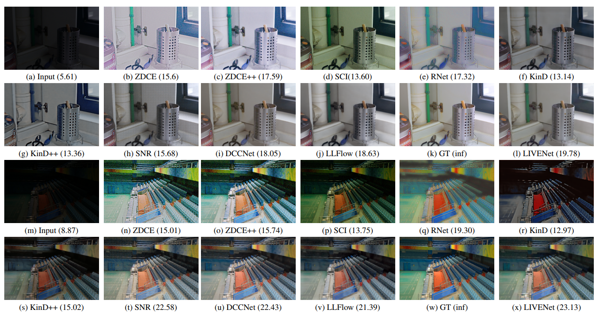

LIVENet: A novel network for real-world low-light image denoising and
enhancement
==============================

This repository contains the source code of our paper, LIVENet (accepted for publication in <a href="https://wacv2024.thecvf.com/">IEEE/CVF Winter Conference on Applications of Computer Vision (WACV'24)</a>).

We propose LIVENet, a novel deep neural network that jointly performs noise reduction on lowlight images and enhances illumination and texture details. LIVENet has two stages: the image enhancement stage and the refinement stage. For the image enhancement stage, we propose a Latent Subspace Denoising Block (LSDB) that uses a low-rank representation of low-light features to suppress the noise and predict a noise-free grayscale image. We propose enhancing an RGB image by eliminating noise. This is done by converting it into YCbCr color space and replacing the noisy luminance (Y) channel with the predicted noise-free grayscale image. LIVENet also predicts the transmission map and atmospheric light in the image enhancement stage. LIVENet produces an enhanced image with rich color and illumination by feeding them to an atmospheric scattering model. In the refinement stage, the texture information from the grayscale image is incorporated into the improved image using a Spatial Feature Transform (SFT) layer.


## Sample Results
<hr>

Check our <a href="https://candlelabai.github.io/LiveNet/">project</a> page for more qualitative results.

<p align="center"></p>

## Get Started
<hr>

### Conda Environment Configuration

Create a conda environment with dependencies
```bash
conda env create -f environment.yml
conda activate livenet
```

### Dataset

Download LoLv1 dataset from <a href="https://daooshee.github.io/BMVC2018website/">here</a>

LoLv1 dataset has 485 training image pairs and 15 test pairs. Place `ours485` and `eval15` directories into `data` folder. 

### Training

change the hyperparameters and configuration parameters according to need in ```src/cfs/lolv1.yaml```.

To train model, Run following command from ```/src``` directory.

```python train.py -opt cfs/lolv1.yaml``` 

All the trained checkpoints will be saved in ```checkpoints``` directory.

All the logs and tensorboard events will be saved in ```logs``` directory.

### Inference

To test model, Run following command from ```/src``` directory.

```python test.py -opt cfs/lolv1.yaml``` 

Above command will predict the test images and print PSNR, SSIM, MAE and LPIPS score.

## Citation
```
@inproceedings{makwana2024livenet,
    title={LIVENet: A novel network for real-world low-light image denoising and enhancement},
    author={Makwana, Dhruv and Deshmukh, Gayatri and Susladkar, Onkar and Mittal, Sparsh and Teja, R},
    booktitle={Proceedings of the IEEE/CVF Winter Conference on Applications of Computer Vision},
    year={2024}
  } 
```

## License
<hr>
CC BY-NC-ND 4.0
